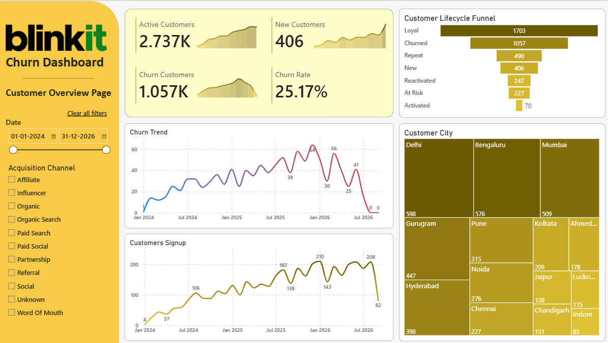
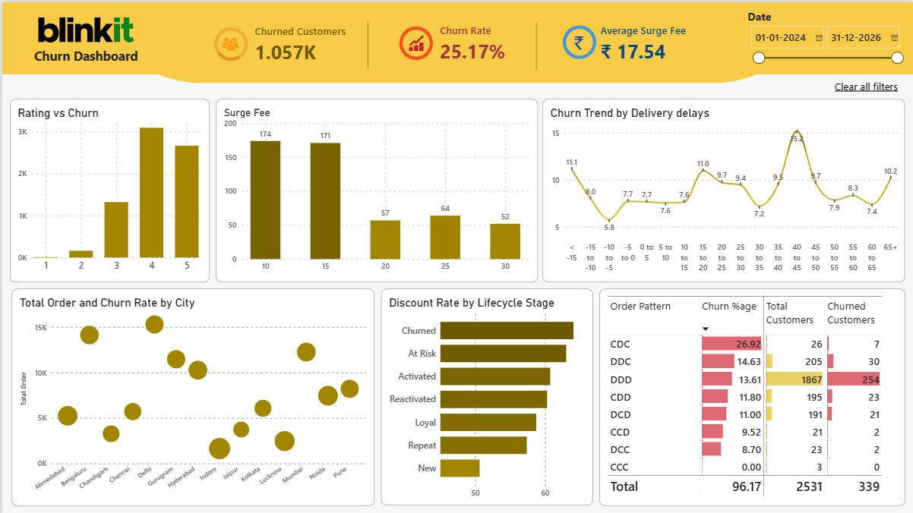
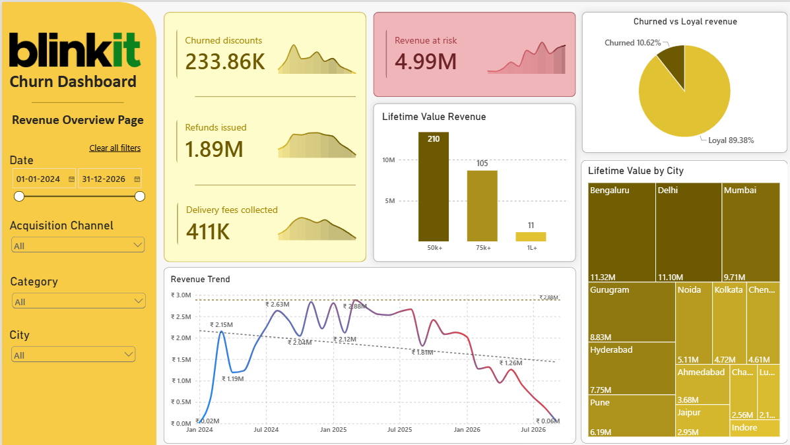
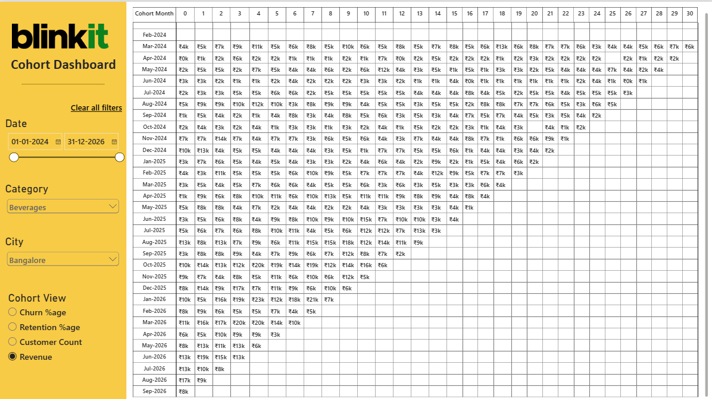

# Blinkit Churn Analysis
A comprehensive analysis of churning customers, their behavior and buying patterns. This covers key business metrics for churn such as revenue segregation, order pattern, trends & forecast, KPIs, cohort analysis, etc. 

**Platforms & Tools** : PostgreSQL & PowerBI \
**Key Skills** : DAX, Power Query, Measures, Window functions, Time Intelligence, RDBMS

---
## Table Schema
Following tables used throughout the project, and `STAR` Schema is used to connect every table:
1. **Data Table**
   - customer (basic customer info such as customer id, signup date and city, etc)
   - customer_feedback (all the feedbacks and reviews given by customers)
   - customer_support (all the queries, complaints and tickets raised by customer)
   - customer_features (advance customer info table consisting order history, churn details etc)
   - orders (all the order history)
   - orders_items (products and SKUs counts by orders and stock info)
   - deliveries (delivery information such as reason of failure of delivery etc)
   - promotions (promotions and discounts info)
2. Dimension Tables
   - customer_id (containing all the customer_ids)
   - order_id (containing all the order_ids)
   - Date Table (having dates to streamline timelines)
3. Measure Table
4. Query Table (imported from database using PSQL)
   - Discount Analysis table
   - Delivery Delay segregation
   - Order Pattern before churn
---

## Business Metrics and Questions 
1. Finding probable factors leading to churn, such as:
   - Late deliveries lead to higher churn?
   - Today's lower ratings indicating future churn?
   - Customer really stop buying after paying surge fees?
   - Does our customer support lead to churn?
2. Is Discounting really helpful in customer retention or we are losing money on churned customers?
3. Is churn demographically predictable?
4. Customer's last 3 order pattern just before churning to know order behavior.
5. Customer Lifetime Value calculation
6. **Cohort Analysis** on churn rate, retention rate, revenue and customer count.
---

## Dashboards
### Customer Overview
This dashboard shows basic metrics such as new customer and churn trend, lifecycle stage funnel, city performance, etc.



### Churn Dashboard
This dashboard shows all the key pointers and trends to analyze churn behavior, including delivery delays and last order patterns.



### Revenue
This dashboard speaks money. It shows how, from where and when revenue generated. It also segregates churned vs loyal revenues.



### COHORT ANALYSIS
This dashboard do a cohort analysis based upon churn rate, retention rate, customer counts and revenue. All the metrics can be easily switched using slicer.



## PostgreSQL Queries
1. Churn definition \
Defining churn as any customer who didn't ordered anything from last 60 days and joined at least 60 days before.
```sql
with last_order as (	-- calculating last order date to use it as current date as dataset isn't live
	select max(order_datetime) as last_order from orders
	),
	order_pattern as (	-- formulating time difference b/w their orders from current last date
	select o.customer_id,
	lo.last_order - o.order_datetime as last_order_since
	from orders o, last_order lo
	group by o.customer_id, o.order_datetime, lo.last_order
	order by o.customer_id asc
	),
	joined_since as(	-- getting the joining date of customers
	select customer_id, signup_datetime from customers
	), 
	churned as (	-- final churned customers based upon criteria
	select op.customer_id, count(op.customer_id) filter(where op.last_order_since <= interval '60 days') as last_60day_order
	from order_pattern op join joined_since js on op.customer_id = js.customer_id , last_order lo
	where lo.last_order - js.signup_datetime >= interval '60 days'
	group by op.customer_id ) 

select customer_id as churned_customers 
from churned 
where last_60day_order = 0;
```

2. Delayed delivery bucketing \
Using bucketing technique to create dynamic intervals without using repeated `CASE` function.
```sql
select case when d.delay_minutes < -15 then 'Less than -15 mins'
	 		when d.delay_minutes > 60 then 'More than 60 mins'
	 		else concat(floor(d.delay_minutes/5.0)*5.0::int , ' to ' , floor((d.delay_minutes/5.0)+1.0)*5.0::int, ' mins')
	 		end as delay_bucket,
count(d.order_id) as delay_count,
round(count(o.customer_id) filter (where cf.lifecycle_stage = 'Churned')::numeric / nullif(count(*), 0)*100, 3) as churn_rate_percentage
from orders o join deliveries d
on o.order_id = d.order_id
join customer_features cf
on o.customer_id = cf.customer_id
where d.delay_minutes is not null
group by delay_bucket
order by min(d.delay_minutes);
```
 
3. Rating and Sentiments vs churn \
How rating & sentiments leads to churn
```sql
-- rating vs churn
select cfeedback.rating as customer_rating, 
round(count(distinct cfeatures.customer_id) filter (where cfeatures.lifecycle_stage = 'Churned')::numeric / nullif(count(*), 0)*100, 3) as churn_rate_percentage
from customer_feedback cfeedback join customer_features cfeatures
on cfeedback.customer_id = cfeatures.customer_id
group by cfeedback.rating; 

-- sentiment vs churn
select cfeedback.sentiment as customer_sentiment, 
round(count(distinct cfeatures.customer_id) filter (where cfeatures.lifecycle_stage = 'Churned')::numeric / nullif(count(*), 0)*100, 3) as churn_rate_percentage
from customer_feedback cfeedback join customer_features cfeatures
on cfeedback.customer_id = cfeatures.customer_id
group by cfeedback.sentiment;
```

4. Discount Analysis \
Analyzing average & median order and discount counts, with discount rate to know whether discounting really effective?
``` sql
with discounts as 
	(select distinct cf.customer_id,
	count (o.customer_id) as order_count,
	count(o.product_discount) filter(where product_discount > 0) discount_count,
	cf.lifecycle_stage
	from orders o join customer_features cf
	on o.customer_id = cf.customer_id
	group by cf.customer_id, cf.lifecycle_stage
	order by discount_count desc)

select lifecycle_stage,
round(avg(order_count), 3) as avg_order_count, 
percentile_cont(0.5) within group (order by order_count) as median_order_count,
round(avg(discount_count), 3) as avg_discount_count,
percentile_cont(0.5) within group (order by discount_count) as median_discount_count,
round(sum(discount_count)::numeric/sum(order_count)*100, 3) as discount_rate_percentage
from discounts
group by lifecycle_stage;
```

5. Last order pattern affecting churn analysis \
Order pattern behavior just before churning to know their last churning orders, for `Cancelled` and `Delivered` orders. First alphabet is the last order, following is previous and so.
```sql
with order_history as
	(select row_number() over(partition by customer_id order by order_datetime) as row_num,
	customer_id,
	order_id,
	order_status,
	lead(order_id, 1) over(partition by customer_id order by order_datetime desc) as previous_order_id,
	lead(order_status, 1) over(partition by customer_id order by order_datetime desc) as previous_order_status,
	lead(order_id, 2) over(partition by customer_id order by order_datetime desc) as previous_2_order_id,
	lead(order_status, 2) over(partition by customer_id order by order_datetime desc) as previous_2_order_status
	from orders)
	
select case when oh.order_status = 'Delivered' and oh.previous_order_status = 'Delivered' and oh.previous_2_order_status = 'Delivered' then 'DDD'
			when oh.order_status = 'Delivered' and oh.previous_order_status = 'Cancelled' and oh.previous_2_order_status = 'Delivered' then 'DCD'
			when oh.order_status = 'Delivered' and oh.previous_order_status = 'Cancelled' and oh.previous_2_order_status = 'Cancelled' then 'DCC'
			when oh.order_status = 'Cancelled' and oh.previous_order_status = 'Delivered' and oh.previous_2_order_status = 'Delivered' then 'CDD'
			when oh.order_status = 'Cancelled' and oh.previous_order_status = 'Cancelled' and oh.previous_2_order_status = 'Delivered' then 'CCD'
			when oh.order_status = 'Cancelled' and oh.previous_order_status = 'Cancelled' and oh.previous_2_order_status = 'Cancelled' then 'CCC'
			when oh.order_status = 'Cancelled' and oh.previous_order_status = 'Delivered' and oh.previous_2_order_status = 'Cancelled' then 'CDC'
			when oh.order_status = 'Delivered' and oh.previous_order_status = 'Delivered' and oh.previous_2_order_status = 'Cancelled' then 'DDC'
			end as order_pattern_in_321,
count(distinct oh.customer_id) as total_customers,
count(distinct oh.customer_id) filter (where cf.lifecycle_stage = 'Churned') as churned_customers,
round(count(distinct oh.customer_id) filter (where cf.lifecycle_stage = 'Churned')::numeric / nullif(count(distinct oh.customer_id), 0)*100, 3) as churn_rate_percentage
from order_history oh join customer_features cf
on oh.customer_id = cf.customer_id
where oh.order_status in ('Delivered', 'Cancelled')
and oh.previous_order_status in ('Delivered', 'Cancelled')
and oh.previous_2_order_status in ('Delivered', 'Cancelled')
and row_num = 3
group by order_pattern_in_321
order by order_pattern_in_321, churn_rate_percentage desc;
```

6. Resolution timing and churn \
Query resolution time bucketing to see whether customer support have churn contribution.
```sql
with cte as (
select *, case when resolution_time_minutes < 60 then 'Less than 60 mins'
			   when resolution_time_minutes >= 2880 then '2880 mins or more'
			   else concat((floor(resolution_time_minutes / 60.0) * 60)::int, ' - ',
			   ((floor(resolution_time_minutes / 60.0) + 1) * 60)::int, ' mins')
			   end as intervals 
from customer_support
order by resolution_time_minutes asc)

select cte.intervals,
round(count(distinct cte.customer_id) filter (where cf.lifecycle_stage = 'Churned')::numeric / nullif(count(distinct cte.customer_id), 0)*100, 3) as churn_rate_percentage
from cte join customer_features cf
on cte.customer_id = cf.customer_id
where resolution_time_minutes is not null
group by cte.intervals
order by churn_rate_percentage desc;
```

7. Customer Lifetime Value \
Calculating Customer Lifetime Value, by taking median lifespan on 70% instead of average of whole to align the trend with current data and do forecast on that.
```sql
with cte as (select round(avg(customer_age_days)/30, 3) as ltv_span,
percentile_cont(0.7) within group (order by customer_age_days)/30 as median_ltv_span
from customer_features)

select cf.customer_id, cf.customer_age_days, cf.total_revenue, 
round(c.median_ltv_span::numeric*(30.0/cf.average_order_interval_days)*cf.average_order_value, 3) as projected_ltv
from customer_features cf, cte c;
```

8. Cohort Analysis \
Cohort Analysis of active users by Quarterly data.
```sql
with user_cohort as
	(  select customer_id, date_trunc('quarter', min(signup_date)) as cohort_date
	from customer_features
	group by customer_id order by signup_date ),
	user_orders as 
	(  select customer_id, date_trunc('quarter', order_datetime) as order_date
	from orders  ) ,
	cohort_index as 
	(  select uo.customer_id, uc.cohort_date, uo.order_date,
	extract(quarter from age(uo.order_date, uc.cohort_date)) as period_number
	from user_cohort uc join user_orders uo
	on uc.customer_id = uo.customer_id
	)

select to_char(cohort_date, '0Q-YYYY') as cohort_quarter, concat('Quarter ', period_number) as period_quarter,
count(distinct customer_id) as active_users
from cohort_index
group by cohort_date, period_number
order by cohort_date, period_number;
```

9. Other queries
- Repeated Service failure
 ``` sql
      
with resolution_status as
	(select distinct cs.customer_id, 
	count(cs.customer_id) filter(where cs.resolution_status = 'Resolved') as resolved_tickets,
	count(cs.customer_id) filter(where cs.resolution_status != 'Resolved') as unresolved_tickets,
	cf.lifecycle_stage
	from customer_support cs join customer_features cf
	on cs.customer_id = cf.customer_id
	group by cs.customer_id, cf.lifecycle_stage
	order by cs.customer_id)

select distinct lifecycle_stage,
sum(resolved_tickets) as resolved_tickets,
sum(unresolved_tickets) as unresolved_tickets,
round(sum(unresolved_tickets)/sum(resolved_tickets), 3) as resolution_ratio
from resolution_status
group by lifecycle_stage;
```
- Cancelled orders by our fault
``` sql
with total_orders as (
    select count(*) as total_count
    from orders o join customer_features cf
    on o.customer_id = cf.customer_id)

select o.cancellation_reason,
count(o.order_id) as cancelled_order_count,
round(count(o.order_id) filter (where o.order_status = 'Cancelled')::numeric / nullif((select total_count from total_orders), 0)*100, 3) as cancellation_rate_percentage,
round(count(distinct o.customer_id) filter (where cf.lifecycle_stage = 'Churned')::numeric / nullif(count(*) filter (where o.order_status = 'Cancelled'), 0)*100, 3) as churn_rate_percentage
from orders o join customer_features cf
on o.customer_id = cf.customer_id
where order_status = 'Cancelled'
group by o.cancellation_reason
order by churn_rate_percentage desc;
```
- Customer Tickets summarization
``` sql
with cte as (select cs.ticket_id, cs.customer_id, cs.resolution_status, cs.resolution_time_minutes, o.reorder_flag
		from customer_support cs join orders o
		on cs.order_id = o.order_id
		order by customer_id)
select resolution_status,
round(avg(resolution_time_minutes) filter(where reorder_flag = '1'), 3) as avg_resolution_time_for_repeat_orders,
percentile_cont(0.5) within group (order by resolution_time_minutes) filter(where reorder_flag = '1') as median_resolution_time,
round(avg(resolution_time_minutes) filter(where reorder_flag = '0'), 3) as avg_resolution_time_for_non_repeat_orders,
percentile_cont(0.5) within group (order by resolution_time_minutes) filter(where reorder_flag = '0') as median_resolution_time
from cte
group by resolution_status;
```
- Campaign & Acquisition Channel
``` sql
-- Churn vs Loyal customers by campaigns
select distinct p.campaign_id,
round(count(distinct p.customer_id) filter (where cf.lifecycle_stage = 'Churned')::numeric / nullif(count(distinct p.customer_id), 0)*100, 3) as churn_rate_percentage,
round(count(distinct p.customer_id) filter (where cf.lifecycle_stage = 'Loyal')::numeric / nullif(count(distinct p.customer_id), 0)*100, 3) as loyal_rate_percentage
from promotions p join customer_features cf
on p.customer_id = cf.customer_id
group by p.campaign_id;

-- Churn vs Loyal customers by acquistion channel
select distinct c.acquisition_channel,
round(count(distinct c.customer_id) filter (where cf.lifecycle_stage = 'Churned')::numeric / nullif(count(distinct c.customer_id), 0)*100, 3) as churn_rate_percentage,
round(count(distinct c.customer_id) filter (where cf.lifecycle_stage = 'Loyal')::numeric / nullif(count(distinct c.customer_id), 0)*100, 3) as loyal_rate_percentage
from customers c join customer_features cf
on c.customer_id = cf.customer_id
group by c.acquisition_channel;
```
